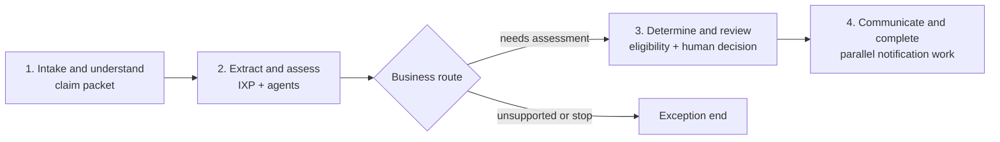

# Claims Process Flow reference pattern

## Purpose and scope

This is the common architecture and storytelling model for the vertical demos. It was derived from the inspected Studio Web export of the FNOL claims reference solution named `ClaimsProcessFlow`. The export is the authoritative implementation source; it is not copied into this repository because it contains tenant-bound resources and generated configuration.

The source illustrates an auto-claims first-notice-of-loss (FNOL) journey: receive a claim packet, understand and extract it, assess loss and eligibility, obtain a human decision, and prepare customer communication. Its value is the visible orchestration of multiple UiPath actor types. New demos must use the pattern below rather than reproduce source-specific IDs, hard-coded sample data, or temporary stub logic.

## What the inspected source contains

The solution manifest contains four deployable projects:

| Project | Role in the reference |
| --- | --- |
| Maestro Flow | Orchestrates intake, document work, agent invocation, routing, review, and completion. |
| Low-code eligibility agent | Classifies damage, injury, complexity, location validity, policy activity, and rationale. |
| LangGraph coded agent | Drafts and self-reviews an acknowledgement email using a UiPath MCP-hosted tool. |
| API workflow | Demonstrates an Integration Service call, HTTP call, conditional branch, loop, JavaScript aggregation, and response. |

The Flow has 26 nodes and 24 edges. It includes a manual claim-packet trigger, DeepRAG page classification, an IXP extractor, two inline autonomous agents, Analyze Files and Web Search agent tools, a context-grounding index, Google A2A and Azure AI Foundry external-agent connectors, three decisions, two Action Center quick forms, parallel communication/completion branches joined by a merge, and a coded-agent invocation.

The extracted Flow’s useful narrative is:

The source already proves that these actors can be composed in one Flow. It does not establish that every individual configuration is ready to be copied into another solution.

## Reference evidence and target standard

| Capability | Evidence in the source | Required standard for new demos |
| --- | --- | --- |
| Visual segmentation | Three coloured sticky-note nodes exist, but their text is empty. | Use 3–4 named sticky notes that divide the canvas into business segments. A viewer must understand the journey without opening node properties. |
| Document intelligence | DeepRAG classifies claim-packet pages and an IXP extractor processes the packet. | Use IXP directly in Flow or behind RPA. State the document inputs, extracted business fields, review condition, and deployed-folder dependency. |
| API and RPA | The solution contains an API workflow, though the exported Flow does not invoke it. | Put both API workflow and RPA on the intended path, each with a visible business responsibility. Do not include either only as an unconnected project. |
| Inline low-code agents | Two inline autonomous agents are wired to Analyze Files, Web Search, and a context index. | Include at least one inline low-code agent and wire at least one tool to it. Declare structured input and output fields that Flow can route on. |
| Coded agent | A LangGraph email writer is invoked from Flow and uses an MCP tool before self-review. | Include one coded agent with a narrowly visible value-add. Treat its tool use and output contract as part of the demo story. |
| External agent | Google A2A and Azure AI Foundry connector nodes are present. | Until a domain-specific external agent is available, include node `uipath.connector.uipath-microsoft-azureaifoundry.execute-the-thread` bound to shared connection `0107247a-0197-42c9-b957-05d1b722b111`. The connection was verified enabled in the Playground `demos` folder on August 12, 2026. Put it on a labelled, non-material showcase branch; send only a static message, discard its output, and make timeout or failure rejoin the unchanged core route. Validate each Flow's binding during implementation. |
| Branching | Three decisions exist, but their current expressions are literal `true`. | Include at least one decision based on a real business value, such as confidence, risk, eligibility, or a human outcome. Label both paths with business language. |
| Human review | Two quick-form Action Center tasks are present. | Include a human task. Prefer a coded action app when a rich review experience strengthens the demo; wire its completion outcome and consume its returned data downstream. |
| Parallel work | Two post-review paths run in parallel and merge. | Use parallelism only for independent work, then visibly merge before the next dependent step. |
| Evaluation | The Flow has one node-level eligibility evaluation point and LLM-judge evaluators. The low-code and coded agents each include five-point evaluation sets. | Every demo includes one evaluation data set with 3–5 representative points and a Flow- or node-based evaluator. The set covers success, an exception, an escalation/review case, and domain-specific edge cases. |
| MCP | The coded email agent loads a UiPath MCP server’s tools and has trajectory/output evaluators. | Where MCP is used, show the server/tool responsibility on the canvas or in the demo narration; evaluate that the important tool call occurred. |

## Required reference topology

Use the following as the default shape for a new vertical demo. Domain language can change; the visible sequencing and actor contrast should remain recognisable.

| Segment | Canvas objective | Typical actors and output |
| --- | --- | --- |
| 1. Receive and understand | Turn a submitted event, case, or document into a usable work item. | Trigger, API workflow or RPA intake, DeepRAG or classifier, IXP. Output: canonical intake summary and extraction confidence. |
| 2. Assess and enrich | Have distinct actors resolve different aspects of the case. | Inline agent with tools and context; coded agent; API/RPA enrichment. Output: structured assessment, rationale, and evidence. A shared Azure AI Foundry node may sit on a separate showcase branch but must not contribute to this output. |
| 3. Decide and review | Make a consequential business route visible and stop for a person where judgement is required. | Decision with real expression; coded action-app human task; exception route. Output: approve, reject, edit, or escalate result. |
| 4. Act and communicate | Complete independent follow-up work and make the result observable. | Parallel branches, coded-agent communication draft, API/RPA write-back, merge, end. Output: case status, customer/employee communication, and audit-ready summary. |

Canvas rules:

- Use three or four sticky notes, one per segment, with a short business title and a consistent colour meaning.
- Lay the happy path left to right. Put exception paths below it; avoid diagonal crossings and long back-edges.
- Keep each segment to a small number of legible nodes. Collapse plumbing into a purposeful API workflow, RPA project, or agent rather than crowding the Flow.
- Name nodes by business action and actor, for example `Extract claim packet (IXP)` or `Review coverage recommendation (Action app)`, not by generic implementation labels.
- Make parallel branches visually symmetric and merge them before a dependent operation.
- Put the shared Azure AI Foundry external-agent node on a clearly labelled showcase branch below the core path. The branch must be controlled by a demo flag, receive no case or sensitive data, discard the agent response, and rejoin without changing business variables, routing, write-backs, or final status.

## Actor design contract

Each domain demo spec must identify its actors using this checklist.

| Actor | Contract to document |
| --- | --- |
| Trigger | Event source, input schema, owning folder, and idempotency/correlation value. |
| IXP | Project/model name, deployed folder, input file, required fields, confidence/review condition, and output mapping. |
| API workflow | Responsibility, inputs, outputs, connector/HTTP dependency, and the Flow node that invokes it. |
| RPA | Business application or document step, input/output contract, exception contract, and why UI automation is necessary instead of an API. |
| Inline agent | Prompt responsibility, model, structured input/output, context, tool(s), guardrails, and branch-driving field. |
| Coded agent | Framework, single visible responsibility, resources/tools, input/output schema, and evaluation expectation. |
| External agent | Azure AI Foundry node `uipath.connector.uipath-microsoft-azureaifoundry.execute-the-thread` through shared connection `0107247a-0197-42c9-b957-05d1b722b111`; connection-selected `agent_id`, static non-sensitive `message`, no `thread_id`, discarded response, demo-flag branch, short timeout/error continuation, and explicit proof that core case state is unchanged. A domain-specific replacement must document its real contract separately. |
| Human task | Reviewer role, information shown, editable fields, outcomes, timeout, downstream data use, and completion edge. |
| MCP server/tool | Server ownership, tool purpose, least-privilege inputs, expected call behaviour, and tool-use evaluator. |
| Data Fabric record and process app (selected variants only) | Entity and choice sets, correlation field, record-created trigger, write-back points, the record-updated wait plus its literal filter and correlation check, app access roles, and the app's independent deployment identity. |

## Human review and coded action apps

Quick forms are suitable for simple approvals. The target baseline favours a coded action app for a review whose evidence, recommended action, or data correction is the hero moment. A coded action app is deployed independently of the `.uipx`; the Flow references the deployed action-app contract.

Its action schema must separate:

- read-only inputs: case facts, extracted evidence, agent rationale, confidence, and affected records;
- editable `inOut` values: proposed classification, amount, priority, or routing;
- reviewer outputs: rationale, selected next step, and escalation detail; and
- named outcomes: for example `Approve`, `Request information`, and `Escalate`.

The Flow must wait on the task’s completion handle, then route from the chosen outcome and returned field IDs. Do not treat a visual form as a terminal node.

The three selected process-app demos replace this mechanism at their primary review point only. See the variant section below.

## Data Fabric-backed process-app variant

Exactly three demos use a coded process app and Data Fabric as the canonical case record. This is an intentional variant of the reference pattern, not an extra requirement for every demo.

### Selected domains

The demo portfolio owner selected the three variants on August 20, 2026 in issue #56. The other six demos keep an Orchestrator queue as the canonical record; that is now a closed decision, not an open one.

| Selected demo | Spec | Why this demo carries the variant |
| --- | --- | --- |
| Commercial banking payment exception | [`commercial-banking/payment-exception-demo-spec.md`](../commercial-banking/payment-exception-demo-spec.md) | It is also the golden-path pilot (issue #59), so the variant mechanics are proven once, first, and in the open. Its reviewer edits proposed repair values, which is the clearest before-and-after record write in the portfolio. |
| Healthcare provider abnormal result follow-up | [`healthcare-provider/abnormal-diagnostic-result-follow-up-demo-spec.md`](../healthcare-provider/abnormal-diagnostic-result-follow-up-demo-spec.md) | Result versions, amendments, and acknowledgment ownership are record state, not queue state. A persistent case record shows aging, re-review, and closure evidence that a transient queue item hides. |
| Life insurance underwriting evidence exception | [`life-insurance/underwriting-evidence-exception-demo-spec.md`](../life-insurance/underwriting-evidence-exception-demo-spec.md) | It has two accountable human stages and long-lived evidence. A queryable record makes proposed-versus-final values, evidence provenance, and the second-person adverse control visible in one place. |

The three cover finance, healthcare, and insurance, so the variant is not concentrated in one buyer story. Each selected demo keeps every other reference requirement.

### Build sequencing

Each selected spec was updated with its variant design before its build issue started (#59, #64, #65), so no demo has to be reworked from a queue design later. Two consequences:

- The Data Fabric entity, its choice sets, and an enabled Data Fabric connection in `JD_Demos/demos` must exist before variant implementation begins. The entity and choice sets are solution resources (`Entity` and `ChoiceSet` kinds); the connection is a folder resource.
- Issue #60 extracts shared build conventions from the pilot. Because the pilot is a variant, it must mark which conventions are variant-specific (entity, record trigger, event wait, process app) and which are shared by all nine demos.

### Design rules for a selected demo

1. A Data Fabric entity record is the canonical case/instance record. There is no parallel Orchestrator queue for the same case.
2. Record creation triggers the Flow and supplies the correlation ID. Use `uipath.connector.trigger.uipath-uipath-dataservice.record-created`; the record `Id` plus the domain correlation field is the idempotency key.
3. The Flow writes back meaningful state transitions and agent outputs to that record, using `uipath.connector.uipath-uipath-dataservice.update-entity-record`. Every visible state in the app is a real field, not a derived guess.
4. At the primary human-in-the-loop point, the reviewer works in the process app and the Flow waits for a record change, not a task completion handle. Use the mid-flow event node `uipath.connector.event.uipath-uipath-dataservice.record-updated`. Role-restricted secondary reviews (compliance, supervisor, coordinator) stay Action Center tasks with completion handles, so both mechanisms remain visible in one demo.
5. The coded process app reads and updates the same record. It must not create a competing source of truth.

### Verified platform mechanics

Verified on August 20, 2026 with `uip` 1.199.0, authenticated as `james.dickson@uipath.com`. Re-validate during implementation instead of trusting these dates.

| Item | Evidence |
| --- | --- |
| Connector | `uipath-uipath-dataservice` ("UiPath Data Fabric"). |
| Connection | `b2a02899-3708-4bb6-810a-02321afb77f6`, enabled, in folder `demos`. It is not the default connection, so each Flow must bind it explicitly. |
| Start trigger | `uipath.connector.trigger.uipath-uipath-dataservice.record-created`, tenant-available. |
| Mid-flow wait | `uipath.connector.event.uipath-uipath-dataservice.record-updated`, tenant-available. It is a `bpmn:ReceiveTask` with `Intsvc.WaitForEvent`, an `input` handle, and `output` plus `error` handles. It does not replace the start trigger. |
| Record activities | `create-entity-record`, `get-entity-record-by-id`, `update-entity-record`, `query-entity-records`, `query-multiple-entity-records`, `delete-entity-record`, and file upload/download/delete on record fields. Agent-tool variants of the read activities exist, so an inline agent can read the record through a tool. |
| Generic trigger configuration | Both nodes are generic triggers. Pass the entity name in `--detail.objectName` when configuring them; the manifest ships that value empty. |
| Filter fields | Every entity field plus `Id`, `CreateTime`, and `UpdateTime` can be filtered. `EventMode` resolves per entity; the inspected entity returned `webhooks`. |

### Correlation at the wait node

The wait node resumes only for the record that started the Flow. Every selected spec states this design:

1. The record-created trigger emits the record. Its output carries `Id` and every entity field, so the instance holds its own record ID from the first node.
2. The wait node filters the event on that record ID. Set `inputs.detail.filterExpression` to a `=js:` template that builds the filter from the instance value, for example ``=js:`Id == '${$vars.<triggerNodeId>.output.Id}'` ``. Add a state condition when the demo also needs the reviewer's submitted status.
3. The wait node therefore fires once, for one case. There is no scan-and-discard loop and no marker field.
4. After the event fires, read the record with `get-entity-record-by-id` and route from the persisted decision fields. The single-record read is required because `MULTILINE_MAX` fields return only a size marker on list and query reads.

Two authoring details, verified on August 20, 2026:

- `uip maestro flow node configure --detail` refuses `filterExpression` and asks for a structured `filter` tree instead. That builder accepts literal values only and checks field names against trigger metadata, which returned no filter fields for the wait variant of the inspected object. So set `filterExpression` in the node's `inputs.detail` and validate the file. A flow carrying the `=js:` template above passes `uip maestro flow validate`.
- Static validation is not runtime proof. Confirm during implementation that the event matcher applies the expression per instance, and record the result.

Also state the resumption latency the demo accepts, and wire the wait node's `error` handle so an event failure takes an owned exception route instead of stalling the case.

### Write constraints the app and the Flow must respect

These come from the Data Fabric SDK and API contract and change the design, so state them in the spec:

- Single-record writes (`insertRecordById`, `updateRecordById`) fire trigger events. Bulk writes (`insertRecords`, `updateRecordsById`) do not. Any path that must resume a Flow, including fixture seeding, uses single-record writes.
- Choice-set fields read and write as integer `numberId` values, never value names. Translate them in both directions.
- `Id`, `CreateTime`, `UpdateTime`, `CreatedBy`, and `UpdatedBy` are row metadata that cannot be written. Domain timestamps need their own fields with distinct names.
- Unknown field keys are silently dropped on insert, and required-field checks are case-sensitive. Read the schema and use field names verbatim.
- `MULTILINE_MAX` fields return a size marker, not content, on list and query reads, and cannot be filtered. Read them with the single-record read, and never write the marker back.
- Every list call returns one page. Operational tables page through the cursor and show a page size of 25 to 50 with a range summary.

### Coded process-app specification

The app is a coded web app in React and TypeScript. It uses the `@uipath/uipath-typescript` SDK, signs the reviewer in through OAuth PKCE, and deploys independently with `uip codedapp pack`, `publish`, and `deploy`. It is not a solution project and never deploys through `uip solution`, so the spec must pin its name, version, folder, and record contract. Declare it in the solution inventory as an `App` resource, which `uip solution resources add --kind App` supports, so the dependency stays visible.

The coded process-app specification must include:

- sign-in screen and dashboard landing page;
- company/app header, sidebar navigation, and user button;
- KPI cards and a paginated case/instance table;
- persistent conversational-agent entry via a chat icon across pages;
- an instance-detail view with identifiers, progress, agent activity, and the specific review-worthy hero moment;
- tabs, modals, and pop-ups for progressive disclosure;
- an opinionated, consistent theme built with the UiPath Apollo design library or compatible primitives; and
- clear loading, empty, error, and permission states.

The app must use real Data Fabric schema fields and paginate operational tables. It should lead the viewer quickly to what happened, what an agent recommended or did, and what needs human attention.

## Evaluation contract

Each demo’s evaluation set contains 3–5 cases, with expected routing and business outputs. Minimum coverage:

| Case | Expected proof |
| --- | --- |
| Straight-through | Correct extraction/assessment and successful completion. |
| Review required | Decision enters the human-review path and returns the expected outcome contract. |
| Business exception | An invalid, ineligible, high-risk, or low-confidence case takes the safe route. |
| Tool or external dependency | The actor either uses its required tool successfully or takes the designed fallback. |

Use a Flow or node evaluator that tests the principal business claim. Add a trajectory or deterministic tool-call evaluator where the demo depends on agent or MCP tool use. Evaluation input must be synthetic and free of customer data.

## Domain-demo mapping checklist

Every domain spec must include this completed mapping before implementation:

| Required entry | What the spec must state |
| --- | --- |
| Use case and hero moment | The recommended enterprise use case, user/role, decision to make, and why the Flow is compelling. |
| Reference segments | The domain-specific name and actor sequence for each of the 3–4 segments. |
| Actor inventory | One row for every actor in the actor design contract above, including actual resource/connection readiness. |
| Flow layout | Sticky-note titles/colours, happy path, exception path, branch expression, parallel branches, and merge. |
| Data model | Inputs, canonical record, outputs, correlation ID, persistence/read-back points, and sensitive-data handling. |
| HITL | Reviewer, coded action app or quick-form rationale, data contract, outcomes, timeout, and resumption path. |
| Evaluation | Dataset name, 3–5 cases, expected outputs/routes, evaluator type, and success threshold. |
| Process-app variant | State the closed selection decision. The three selected demos document the full Data Fabric/process-app design; the other six record `not selected` with the queue as canonical record. |
| Solution boundary | `<domain>/<demo>/<demo>-solution/`, exactly one `.uipx`, nested Flow project layout, globally unique package name, and independent deployment boundary. |
| Delivery | Resource refresh before pack, immutable package version, and CI validation scoped to the changed solution. |

## Source quality findings carried forward

The export is a reference for breadth and storytelling, not an implementation template. Static validation of the downloaded Flow reported missing sticky-note definitions, obsolete quick-form outcome handles, an IXP input expression that is not in canonical form, a shared-connection warning, and a non-canonical Flow filename/layout. Static validation of its API workflow also reported incomplete managed-HTTP configuration. The Flow evaluation set has one eligibility point; the five-point sets are attached to the low-code and coded agents.

Accordingly, every new demo must validate its own Flow, API workflow, agent projects, and RPA project before packaging. It must use real business expressions, declared node definitions/handles, verified resources, and current CLI-supported project layouts. These constraints improve the reference without weakening its core visual and multi-actor story.
