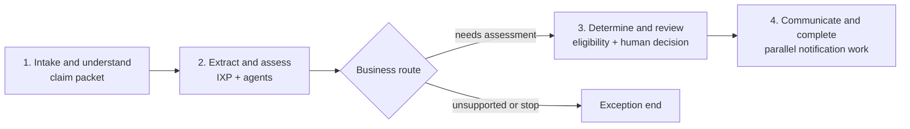

# Claims Process Flow reference pattern

## Purpose and scope

This is the common architecture and storytelling model for the vertical demos. It was derived from the inspected Studio Web export of the FNOL claims reference solution named `ClaimsProcessFlow`. The export is the authoritative implementation source; it is not copied into this repository because it contains tenant-bound resources and generated configuration.

The source illustrates an auto-claims first-notice-of-loss (FNOL) journey: receive a claim packet, understand and extract it, assess loss and eligibility, obtain a human decision, and prepare customer communication. Its value is the visible orchestration of multiple UiPath actor types. New demos must use the pattern below rather than reproduce source-specific IDs, hard-coded sample data, or temporary stub logic.

## What the inspected source contains

The solution manifest contains four deployable projects:

| Project | Role in the reference |
| --- | --- |
| Maestro Flow | Orchestrates intake, document work, agent invocation, routing, review, and completion. |
| Low-code eligibility agent | Classifies damage, injury, complexity, location validity, policy activity, and rationale. |
| LangGraph coded agent | Drafts and self-reviews an acknowledgement email using a UiPath MCP-hosted tool. |
| API workflow | Demonstrates an Integration Service call, HTTP call, conditional branch, loop, JavaScript aggregation, and response. |

The Flow has 26 nodes and 24 edges. It includes a manual claim-packet trigger, DeepRAG page classification, an IXP extractor, two inline autonomous agents, Analyze Files and Web Search agent tools, a context-grounding index, Google A2A and Azure AI Foundry external-agent connectors, three decisions, two Action Center quick forms, parallel communication/completion branches joined by a merge, and a coded-agent invocation.

The extracted Flow’s useful narrative is:

The source already proves that these actors can be composed in one Flow. It does not establish that every individual configuration is ready to be copied into another solution.

## Reference evidence and target standard

| Capability | Evidence in the source | Required standard for new demos |
| --- | --- | --- |
| Visual segmentation | Three coloured sticky-note nodes exist, but their text is empty. | Use 3–4 named sticky notes that divide the canvas into business segments. A viewer must understand the journey without opening node properties. |
| Document intelligence | DeepRAG classifies claim-packet pages and an IXP extractor processes the packet. | Use IXP directly in Flow or behind RPA. State the document inputs, extracted business fields, review condition, and deployed-folder dependency. |
| API and RPA | The solution contains an API workflow, though the exported Flow does not invoke it. | Put both API workflow and RPA on the intended path, each with a visible business responsibility. Do not include either only as an unconnected project. |
| Inline low-code agents | Two inline autonomous agents are wired to Analyze Files, Web Search, and a context index. | Include at least one inline low-code agent and wire at least one tool to it. Declare structured input and output fields that Flow can route on. |
| Coded agent | A LangGraph email writer is invoked from Flow and uses an MCP tool before self-review. | Include one coded agent with a narrowly visible value-add. Treat its tool use and output contract as part of the demo story. |
| External agent | Google A2A and Azure AI Foundry connector nodes are present. | Use an external agent when a working connection is available. If it is not, record the unavailable connection and use another approved actor; do not ship a fake connection ID. |
| Branching | Three decisions exist, but their current expressions are literal `true`. | Include at least one decision based on a real business value, such as confidence, risk, eligibility, or a human outcome. Label both paths with business language. |
| Human review | Two quick-form Action Center tasks are present. | Include a human task. Prefer a coded action app when a rich review experience strengthens the demo; wire its completion outcome and consume its returned data downstream. |
| Parallel work | Two post-review paths run in parallel and merge. | Use parallelism only for independent work, then visibly merge before the next dependent step. |
| Evaluation | The Flow has one node-level eligibility evaluation point and LLM-judge evaluators. The low-code and coded agents each include five-point evaluation sets. | Every demo includes one evaluation data set with 3–5 representative points and a Flow- or node-based evaluator. The set covers success, an exception, an escalation/review case, and domain-specific edge cases. |
| MCP | The coded email agent loads a UiPath MCP server’s tools and has trajectory/output evaluators. | Where MCP is used, show the server/tool responsibility on the canvas or in the demo narration; evaluate that the important tool call occurred. |

## Required reference topology

Use the following as the default shape for a new vertical demo. Domain language can change; the visible sequencing and actor contrast should remain recognisable.

| Segment | Canvas objective | Typical actors and output |
| --- | --- | --- |
| 1. Receive and understand | Turn a submitted event, case, or document into a usable work item. | Trigger, API workflow or RPA intake, DeepRAG or classifier, IXP. Output: canonical intake summary and extraction confidence. |
| 2. Assess and enrich | Have distinct actors resolve different aspects of the case. | Inline agent with tools and context; coded agent; optional external agent through a verified connector; API/RPA enrichment. Output: structured assessment, rationale, and evidence. |
| 3. Decide and review | Make a consequential business route visible and stop for a person where judgement is required. | Decision with real expression; coded action-app human task; exception route. Output: approve, reject, edit, or escalate result. |
| 4. Act and communicate | Complete independent follow-up work and make the result observable. | Parallel branches, coded-agent communication draft, API/RPA write-back, merge, end. Output: case status, customer/employee communication, and audit-ready summary. |

Canvas rules:

- Use three or four sticky notes, one per segment, with a short business title and a consistent colour meaning.
- Lay the happy path left to right. Put exception paths below it; avoid diagonal crossings and long back-edges.
- Keep each segment to a small number of legible nodes. Collapse plumbing into a purposeful API workflow, RPA project, or agent rather than crowding the Flow.
- Name nodes by business action and actor, for example `Extract claim packet (IXP)` or `Review coverage recommendation (Action app)`, not by generic implementation labels.
- Make parallel branches visually symmetric and merge them before a dependent operation.

## Actor design contract

Each domain demo spec must identify its actors using this checklist.

| Actor | Contract to document |
| --- | --- |
| Trigger | Event source, input schema, owning folder, and idempotency/correlation value. |
| IXP | Project/model name, deployed folder, input file, required fields, confidence/review condition, and output mapping. |
| API workflow | Responsibility, inputs, outputs, connector/HTTP dependency, and the Flow node that invokes it. |
| RPA | Business application or document step, input/output contract, exception contract, and why UI automation is necessary instead of an API. |
| Inline agent | Prompt responsibility, model, structured input/output, context, tool(s), guardrails, and branch-driving field. |
| Coded agent | Framework, single visible responsibility, resources/tools, input/output schema, and evaluation expectation. |
| External agent | Vendor/protocol, connector and connection prerequisite, request/response schema, timeout/error route, and fallback when unavailable. |
| Human task | Reviewer role, information shown, editable fields, outcomes, timeout, downstream data use, and completion edge. |
| MCP server/tool | Server ownership, tool purpose, least-privilege inputs, expected call behaviour, and tool-use evaluator. |

## Human review and coded action apps

Quick forms are suitable for simple approvals. The target baseline favours a coded action app for a review whose evidence, recommended action, or data correction is the hero moment. A coded action app is deployed independently of the `.uipx`; the Flow references the deployed action-app contract.

Its action schema must separate:

- read-only inputs: case facts, extracted evidence, agent rationale, confidence, and affected records;
- editable `inOut` values: proposed classification, amount, priority, or routing;
- reviewer outputs: rationale, selected next step, and escalation detail; and
- named outcomes: for example `Approve`, `Request information`, and `Escalate`.

The Flow must wait on the task’s completion handle, then route from the chosen outcome and returned field IDs. Do not treat a visual form as a terminal node.

## Data Fabric-backed process-app variant

Exactly three demos will later use a coded process app and Data Fabric as the canonical case record. This is an intentional variant of the reference pattern, not an extra requirement for every demo. The three domains will be selected in later issues.

For each selected demo:

1. A Data Fabric entity record is the canonical case/instance record.
2. Record creation triggers the Flow and supplies the correlation ID.
3. The Flow writes back meaningful state transitions and agent outputs to that record.
4. At human-in-the-loop points, the Flow waits for a Data Fabric record-change trigger rather than treating the UI as a detached task.
5. The coded process app reads and updates the same record. It must not create a competing source of truth.

The coded process-app specification must include:

- sign-in screen and dashboard landing page;
- company/app header, sidebar navigation, and user button;
- KPI cards and a paginated case/instance table;
- persistent conversational-agent entry via a chat icon across pages;
- an instance-detail view with identifiers, progress, agent activity, and the specific review-worthy hero moment;
- tabs, modals, and pop-ups for progressive disclosure;
- an opinionated, consistent theme built with the UiPath Apollo design library or compatible primitives; and
- clear loading, empty, error, and permission states.

The app must use real Data Fabric schema fields and paginate operational tables. It should lead the viewer quickly to what happened, what an agent recommended or did, and what needs human attention.

## Evaluation contract

Each demo’s evaluation set contains 3–5 cases, with expected routing and business outputs. Minimum coverage:

| Case | Expected proof |
| --- | --- |
| Straight-through | Correct extraction/assessment and successful completion. |
| Review required | Decision enters the human-review path and returns the expected outcome contract. |
| Business exception | An invalid, ineligible, high-risk, or low-confidence case takes the safe route. |
| Tool or external dependency | The actor either uses its required tool successfully or takes the designed fallback. |

Use a Flow or node evaluator that tests the principal business claim. Add a trajectory or deterministic tool-call evaluator where the demo depends on agent or MCP tool use. Evaluation input must be synthetic and free of customer data.

## Domain-demo mapping checklist

Every domain spec must include this completed mapping before implementation:

| Required entry | What the spec must state |
| --- | --- |
| Use case and hero moment | The recommended enterprise use case, user/role, decision to make, and why the Flow is compelling. |
| Reference segments | The domain-specific name and actor sequence for each of the 3–4 segments. |
| Actor inventory | One row for every actor in the actor design contract above, including actual resource/connection readiness. |
| Flow layout | Sticky-note titles/colours, happy path, exception path, branch expression, parallel branches, and merge. |
| Data model | Inputs, canonical record, outputs, correlation ID, persistence/read-back points, and sensitive-data handling. |
| HITL | Reviewer, coded action app or quick-form rationale, data contract, outcomes, timeout, and resumption path. |
| Evaluation | Dataset name, 3–5 cases, expected outputs/routes, evaluator type, and success threshold. |
| Process-app variant | Mark `not selected` or document the Data Fabric/process-app design when the demo is one of the three selected. |
| Solution boundary | `<domain>/<demo>/<demo>-solution/`, exactly one `.uipx`, nested Flow project layout, globally unique package name, and independent deployment boundary. |
| Delivery | Resource refresh before pack, immutable package version, and CI validation scoped to the changed solution. |

## Source quality findings carried forward

The export is a reference for breadth and storytelling, not an implementation template. Static validation of the downloaded Flow reported missing sticky-note definitions, obsolete quick-form outcome handles, an IXP input expression that is not in canonical form, a shared-connection warning, and a non-canonical Flow filename/layout. Static validation of its API workflow also reported incomplete managed-HTTP configuration. The Flow evaluation set has one eligibility point; the five-point sets are attached to the low-code and coded agents.

Accordingly, every new demo must validate its own Flow, API workflow, agent projects, and RPA project before packaging. It must use real business expressions, declared node definitions/handles, verified resources, and current CLI-supported project layouts. These constraints improve the reference without weakening its core visual and multi-actor story.
